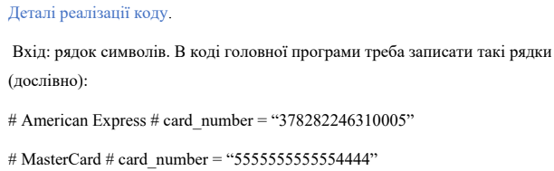
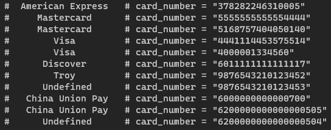

# Умова


# Вивід


# Задання платіжних систем
```csharp
List<PaymentSystem> paymentSystems = new List<PaymentSystem>
            {
                new PaymentSystem("Visa", new List<string> { "4" }, new List<ushort> { 16, 13 }),
                new PaymentSystem("Mastercard", new List<string> { "51", "55" }, new List<ushort> { 16 }),
                ...
            }
```
