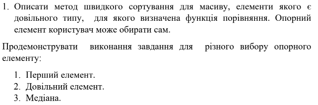
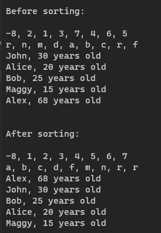

# Умова

# Вивід

# Main
``` csharp
static void Main(string[] args)
        {
            int[] integerArray = new[] { -8, 2, 1, 3, 7, 4, 6, 5 };
            char[] charArray = new[] {'r', 'n','m','d','a','b', 'c','r', 'f' };
            Person[] people = new Person[]
            {
            new Person { Name = "John", Age = 30 },
            new Person { Name = "Alice", Age = 20 },
            new Person { Name = "Bob", Age = 25 },
            new Person { Name = "Maggy", Age= 15 },
            new Person { Name = "Alex", Age= 68 }
            };

            Console.WriteLine("Before sorting:\n");

            Console.WriteLine(string.Join(", ", integerArray));
            Console.WriteLine(string.Join(", ", charArray));
            foreach (var person in people)
            {
                Console.WriteLine(person);
            }


            int[] sortedInts = integerArray.QuickSortMedian(); // сортуємо за зростанням
            char[] sortedChars = charArray.QuickSortRandom(); // сортуємо за зростанням
            Person[] sortedPeople = people.QuickSortFirst(false); // сортуємо за спаданням

            Console.WriteLine("\n\nAfter sorting:\n");
            Console.WriteLine(string.Join(", ", sortedInts));
            Console.WriteLine(string.Join(", ", sortedChars));
            foreach (var person in sortedPeople)
            {
                Console.WriteLine(person);
            }
        }
```