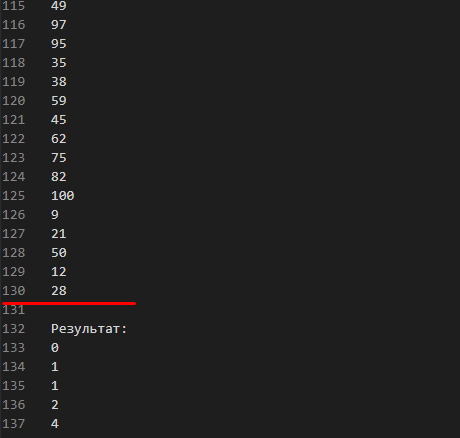
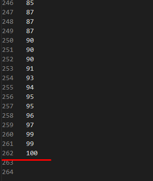

# Вхідні дані

# Вихідні дані


# Main
``` csharp
public static void Main()
{
    ExternalMergeSorting externalMergeSorting = new ExternalMergeSorting();

    externalMergeSorting.Perform(130, 50);
}
```
